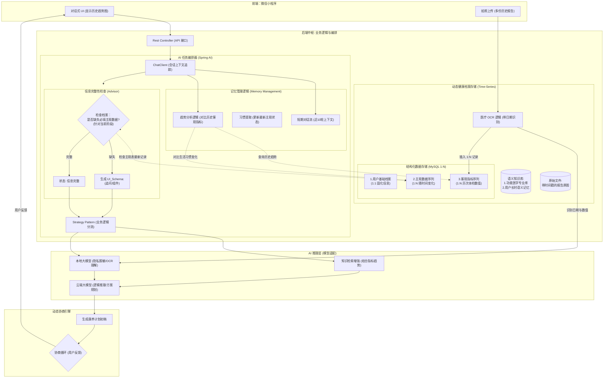

```mermaid
graph TD
    %% 1. 前端交互层
    subgraph Client ["前端：微信小程序"]
        UI["对话式 UI (显示历史趋势图)"]
        Cam["拍照上传 (多份历史报告)"]
    end

    %% 2. 后端中枢 (Java / Spring AI)
    subgraph Backend ["后端中枢: 业务逻辑与编排"]
        Gate["Rest Controller (API 接口)"]
        
        subgraph Orchestrator ["AI 任务编排器 (Spring AI)"]
            ChatClient["ChatClient (会话上下文追踪)"]
            
            subgraph MemoryManager ["记忆管理逻辑 (Memory Management)"]
                History["短期对话流 (近10轮上下文)"]
                ContextExtractor["习惯提取 (更新最新主观状态)"]
                TrendAnalyzer["趋势分析逻辑 (对比历史客观指标)"]
            end

            subgraph InfoCheck ["信息完整性检查 (Advisor)"]
                CheckLogic{"检查档案：<br/>是否缺失必填主观数据?<br/>(针对当前阶段)"}
                AwaitingInput["生成 UI_Schema:<br/>(追问/组件)"]
                InformationComplete["状态: 信息完整"]
            end
            
            Strategy["Strategy Pattern (业务逻辑分流)"]
        end

        %% 存储层 (强化 1:N 关系与时间戳)
        subgraph Storage ["动态健康档案存储 (Time-Series)"]
            OCR_Tool["医疗 OCR 逻辑 (带日期识别)"]
            subgraph StructuredDB ["结构化数据存储 (MySQL 1:N)"]
                BaseProfile["1.用户基础档案<br/> (1:1 固化信息)"]
                SubjectiveData["2.主观数据序列<br/> (1:N 随时间变化)"]
                MedicalData["3.客观指标序列<br/> (1:N 历次体检数值)"]
            end
            VectorDB[("语义知识库: <br/>1.功能医学专业库<br/>2.用户长时语义记忆")]
            FileStore[("原始文件: <br/>带时间戳的报告原图")]
        end
    end

    %% 3. AI 推理层
    subgraph AICore ["AI 推理层 (模型适配)"]
        RAG["知识检索增强 (结合指标趋势)"]
        CloudModel["云端大模型 (逻辑推理/方案规划)"]
        LocalModel["本地大模型 (隐私脱敏/OCR理解)"]
    end

    %% 4. 落地协商层
    subgraph Negotiation ["动态协商引擎"]
        DraftPlan["生成康养计划初稿"]
        Loop{"协商循环 (用户反馈)"}
    end

    %% 逻辑流转
    UI --> Gate
    Cam --> OCR_Tool
    OCR_Tool -- "识别日期与数值" --> LocalModel
    OCR_Tool -- "插入 1:N 记录" --> MedicalData
    Gate --> ChatClient
    
    %% 档案检索逻辑 (带有时间维度)
    ChatClient --> History
    ChatClient --> TrendAnalyzer
    TrendAnalyzer -. "查询历史趋势" .-> MedicalData
    TrendAnalyzer -. "对比生活习惯变化" .-> SubjectiveData

    %% 信息检查环节
    ChatClient --> InfoCheck
    InfoCheck --> CheckLogic
    CheckLogic -. 检查主观表最新记录 .-> SubjectiveData
    
    %% 决策分支
    CheckLogic -- "缺失" --> AwaitingInput --> Strategy
    CheckLogic -- "完整" --> InformationComplete --> Strategy
    
    %% 最终生成 (Prompt 会包含: '由于您近三个月血糖持续下降...')
    Strategy --> RAG --> CloudModel
    Strategy --> LocalModel --> CloudModel
    CloudModel --> DraftPlan --> Loop
    Loop -- "用户反馈" --> UI
```
