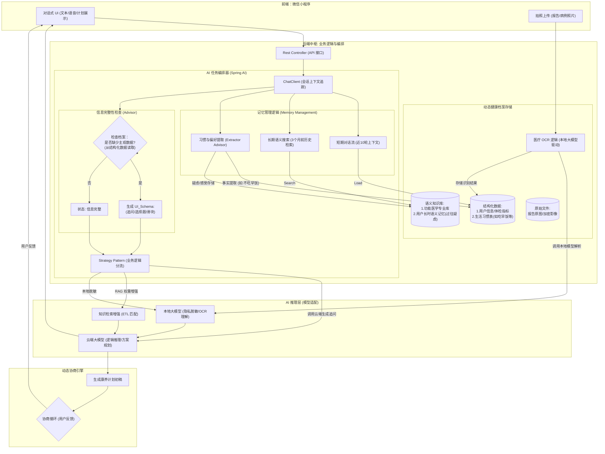

```mermaid
graph TD
    %% 1. 前端交互层
    subgraph Client ["前端：微信小程序"]
        UI["对话式 UI (文本/语音/计划展示)"]
        Cam["拍照上传 (报告/病例照片)"]
    end

    %% 2. 后端中枢 (Java / Spring AI)
    subgraph Backend ["后端中枢: 业务逻辑与编排"]
        Gate["Rest Controller (API 接口)"]
        
        %% Orchestrator 内部逻辑细化
        subgraph Orchestrator ["AI 任务编排器 (Spring AI)"]
            ChatClient["ChatClient (会话上下文追踪)"]
            
            subgraph MemoryManager ["记忆管理逻辑 (Memory Management)"]
                History["短期对话流 (近10轮上下文)"]
                ContextExtractor["习惯与偏好提取 (Extractor Advisor)"]
                LongTermSearch["长期语义搜索 (3个月前历史检索)"]
            end

            subgraph InfoCheck ["信息完整性检查 (Advisor)"]
                CheckLogic{"检查档案：<br/>是否缺少主观数据?<br/>(从结构化数据读取)"}
                AwaitingInput["生成 UI_Schema:<br/>(追问/选择题/滑块)"]
                InformationComplete["状态: 信息完整"]
            end
            
            Strategy["Strategy Pattern (业务逻辑分流)"]
        end

        %% 存储层 (内容驱动)
        subgraph Storage ["动态健康档案存储"]
            OCR_Tool["医疗 OCR 逻辑 (本地大模型驱动)"]
            StructuredDB[("结构化数据: <br/>1.用户信息/体检指标<br/>2.生活习惯表(如吃早饭等)")]
            VectorDB[("语义知识库: <br/>1.功能医学专业库<br/>2.用户长时语义记忆(过往疑虑)")]
            FileStore[("原始文件: <br/>报告原图/加密影像")]
        end
    end

    %% 3. AI 推理层
    subgraph AICore ["AI 推理层 (模型适配)"]
        RAG["知识检索增强 (ETL 匹配)"]
        CloudModel["云端大模型 (逻辑推理/方案规划)"]
        LocalModel["本地大模型 (隐私脱敏/OCR理解)"]
    end

    %% 4. 落地协商层
    subgraph Negotiation ["动态协商引擎"]
        DraftPlan["生成康养计划初稿"]
        Loop{"协商循环 (用户反馈)"}
    end

    %% 逻辑流转 (带记忆加载与提取)
    UI --> Gate
    Cam --> OCR_Tool
    OCR_Tool -- "调用本地模型解析" --> LocalModel
    OCR_Tool -- "存储识别结果" --> StructuredDB
    Gate --> ChatClient
    
    %% 记忆加载流
    ChatClient --> History -- "Load" --> StructuredDB
    ChatClient --> LongTermSearch -- "Search" --> VectorDB
    
    %% 记忆提取流 (异步更新)
    ChatClient --> ContextExtractor
    ContextExtractor -- "事实提取 (如:不吃早饭)" --> StructuredDB
    ContextExtractor -- "疑虑/感受存储" --> VectorDB

    %% 信息检查环节
    ChatClient --> InfoCheck
    InfoCheck --> CheckLogic
    
    %% 分支 A: 信息缺失
    CheckLogic -- "是" --> AwaitingInput
    AwaitingInput --> Strategy
    Strategy -- "调用云端生成追问" --> CloudModel
    CloudModel --> UI
    
    %% 分支 B: 信息完整
    CheckLogic -- "否" --> InformationComplete
    InformationComplete --> Strategy
    Strategy -- "RAG 权重增强" --> RAG
    Strategy -- "本地脱敏" --> LocalModel
    
    %% 生成计划
    RAG --> CloudModel
    LocalModel --> CloudModel
    CloudModel --> DraftPlan
    DraftPlan --> Loop
    Loop -- "用户反馈" --> UI
```
