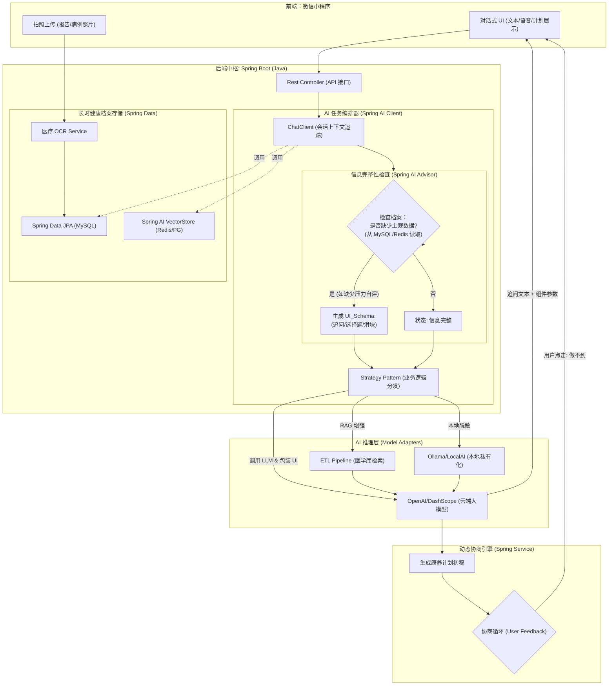

```mermaid
graph TD
    %% 1. 前端交互层
    subgraph Client ["前端：微信小程序"]
        UI["对话式 UI (文本/语音/计划展示)"]
        Cam["拍照上传 (报告/病例照片)"]
    end

    %% 2. 后端服务与中枢 (Spring Boot 实现)
    subgraph Backend ["后端中枢: Spring Boot (Java)"]
        Gate["Rest Controller (API 接口)"]
        
        %% 细化后的 Orchestrator (Spring AI 核心)
        subgraph Orchestrator ["AI 任务编排器 (Spring AI Client)"]
            ChatClient["ChatClient (会话上下文追踪)"]
            
            subgraph InfoCheck ["信息完整性检查 (Spring AI Advisor)"]
                CheckLogic{"检查档案：<br/>是否缺少主观数据?<br/>(从 MySQL/Redis 读取)"}
                AwaitingInput["生成 UI_Schema:<br/>(追问/选择题/滑块)"]
                InformationComplete["状态: 信息完整"]
            end
            
            Strategy["Strategy Pattern (业务逻辑分发)"]
        end

        %% 持久化层
        subgraph Storage ["长时健康档案存储 (Spring Data)"]
            OCR_Tool["医疗 OCR Service"]
            JPA_Repo["Spring Data JPA (MySQL)"]
            VectorStore["Spring AI VectorStore (Redis/PG)"]
        end
    end

    %% 3. AI 推理与知识层 (Spring AI 模型适配)
    subgraph AICore ["AI 推理层 (Model Adapters)"]
        RAG["ETL Pipeline (医学库检索)"]
        CloudModel["OpenAI/DashScope (云端大模型)"]
        LocalModel["Ollama/LocalAI (本地私有化)"]
    end

    %% 4. 落地协商层
    subgraph Negotiation ["动态协商引擎 (Spring Service)"]
        DraftPlan["生成康养计划初稿"]
        Loop{"协商循环 (User Feedback)"}
    end

    %% 逻辑流转
    UI --> Gate
    Cam --> OCR_Tool --> JPA_Repo
    Gate --> ChatClient
    
    %% 档案汇聚
    ChatClient -. 调用 .-> JPA_Repo
    ChatClient -. 调用 .-> VectorStore
    
    %% 进入信息检查环节 (Advisor 拦截器逻辑)
    ChatClient --> InfoCheck
    InfoCheck --> CheckLogic
    
    %% 逻辑分支 - A (信息缺失)
    CheckLogic -- "是 (如缺少压力自评)" --> AwaitingInput
    AwaitingInput --> Strategy
    Strategy -- "调用 LLM & 包装 UI" --> CloudModel
    CloudModel -- "追问文本 + 组件参数" --> UI
    
    %% 逻辑分支 - B (信息完整)
    CheckLogic -- "否" --> InformationComplete
    InformationComplete --> Strategy
    Strategy -- "RAG 增强" --> RAG
    Strategy -- "本地脱敏" --> LocalModel
    
    %% 生成计划
    RAG --> CloudModel
    LocalModel --> CloudModel
    CloudModel --> DraftPlan
    DraftPlan --> Loop
    Loop -- "用户点击: 做不到" --> UI
```
