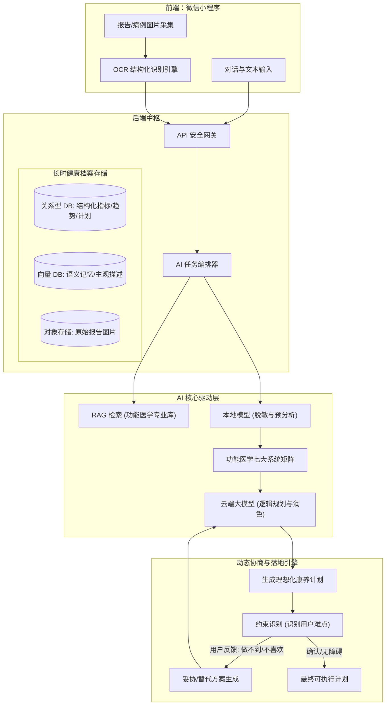

```mermaid
graph TD
    %% 第一阶段：多模态输入
    subgraph Client ["前端：微信小程序"]
        UI["对话与文本输入"]
        Upload["报告/病例图片采集"]
        OCR["OCR 结构化识别引擎"]
    end

    %% 第二阶段：数据中枢
    subgraph Backend ["后端中枢"]
        Gate["API 安全网关"]
        Task["AI 任务编排器"]
        
        subgraph Storage ["长时健康档案存储"]
            SQL[("关系型 DB: 结构化指标/趋势/计划")]
            VecDB[("向量 DB: 语义记忆/主观描述")]
            OSS[("对象存储: 原始报告图片")]
        end
    end

    %% 第三阶段：功能医学 AI 大脑
    subgraph AICore ["AI 核心驱动层"]
        RAG["RAG 检索 (功能医学专业库)"]
        LLM_Local["本地模型 (脱敏与预分析)"]
        LLM_Cloud["云端大模型 (逻辑规划与润色)"]
        Matrix["功能医学七大系统矩阵"]
    end

    %% 第四阶段：协商与执行引擎 (核心差异化)
    subgraph Negotiation ["动态协商与落地引擎"]
        InitialPlan["生成理想化康养计划"]
        Feedback["约束识别 (识别用户难点)"]
        Strategy["妥协/替代方案生成"]
        FinalPlan["最终可执行计划"]
    end

    %% 逻辑流转
    UI --> Gate
    Upload --> OCR --> Gate
    Gate --> Task
    Task --> RAG
    Task --> LLM_Local
    LLM_Local --> Matrix
    Matrix --> LLM_Cloud
    LLM_Cloud --> InitialPlan
    InitialPlan --> Feedback
    Feedback -- "用户反馈: 做不到/不喜欢" --> Strategy
    Strategy --> LLM_Cloud
    Feedback -- "确认/无障碍" --> FinalPlan
```
